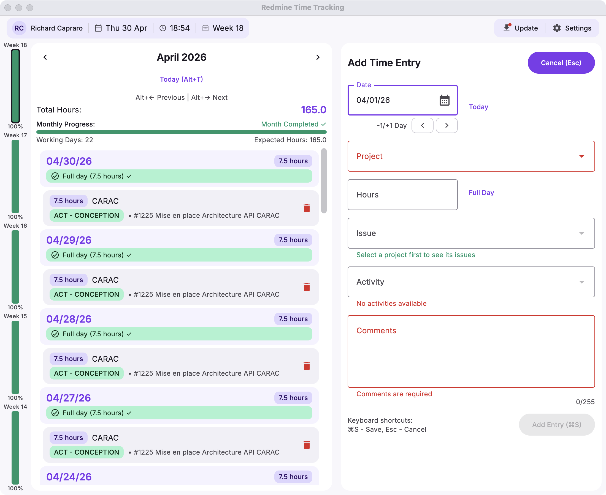

# RedmineTime

A desktop application for managing time entries in Redmine with a modern user interface built using Compose for Desktop.

[Version française (French version)](README_FR.md)



*The screenshot above shows the application in light theme. The application also supports a dark theme that can be
enabled in the settings.*

## Features

- **Monthly time entry overview** with intuitive navigation
- **Weekly and monthly progress bars** with completion percentage and tooltips per ISO week
- **Configurable working time** — daily target (6 / 6.5 / 7 / 7.5 h) and up to four non-working weekdays
- **Add, edit, and delete time entries** with comprehensive validation
- **Duplicate entries** to the same day, the next working day, or over a date range
- **Bulk edit and bulk delete** — select several entries to change project, activity, issue, hours, or comment in one go
- **Project, issue, and activity pickers** with searchable dropdowns
- **Easy month navigation** with arrow buttons, a "Today" shortcut, and keyboard shortcuts
- **In-app help** (top-bar Help button) summarizing actions, icons, and shortcuts
- **In-app updates** — a "Download" button appears in the top bar when a new stable release is available
- **Impersonation** — administrators can log time on behalf of any Redmine user from the top bar
- **Live status bar** showing today's date, the current time, and the ISO week number
- **SSL support** (including self-signed certificates with automatic trust and hostname verification disabled)
- **Native look and feel** that integrates with your operating system
- **Light and dark theme support**
- **Keyboard shortcuts** for improved productivity
- **Multilingual support** (French and English) with intelligent fallback
- **Robust error handling** with user-friendly error messages
- **Real-time validation** for all form fields

## Language Support

The application supports multiple languages with an intelligent fallback system:

- French (default language)
    - Primary language for all users
    - Falls back to English if a translation is missing

- English (fallback language)
    - Alternative language
    - Falls back to French if a translation is missing

### Language Configuration

The application uses French by default. You can change the language in the configuration panel:

1. Click the **Settings** button (gear icon) in the top bar
2. Select your preferred language (French or English) from the dropdown
3. Click Save

The application will reload with the selected language, and all dates will be formatted according to the selected
language.

Note: The application will automatically handle missing translations by falling back to the alternative language.

## Prerequisites

- Java Development Kit (JDK) 21 or later
- Redmine server instance (with API access enabled)

## Configuration

The application can be configured in two ways:

### GUI Configuration

Click the **Settings** button (gear icon) in the top bar to open the configuration dialog. You can set:

- **Redmine URL**
- **API Key** — the Redmine API key (a show/hide toggle and a "How to get your API key?" link are provided)
- **Dark theme** — toggle between light and dark Material 3 color schemes
- **Language** — French or English
- **Hours per day** — 6, 6.5, 7, or 7.5 (drives daily/weekly/monthly targets)
- **Non-working days** — pick up to 4 weekdays (Mon–Fri) that should not count as working days

The configuration is automatically saved and stored securely using Java Preferences API in your system's preferences:

- Windows: Registry under `HKEY_CURRENT_USER\Software\JavaSoft\Prefs`
- macOS: `~/Library/Preferences/com.ps.redmine.plist` (Key: `/com/ps/redmine`)
- Linux: `~/.java/.userPrefs/com/ps/redmine/prefs.xml`

The configuration values are stored under the node `/com/ps/redmine` in these system-specific locations.

### Environment Variables

Alternatively, you can use environment variables (they take precedence over saved configuration):

- `REDMINE_URL`: The URL of your Redmine server
- `REDMINE_API_KEY`: Your Redmine API key
- `REDMINE_DARK_THEME`: Set to "true" to enable the dark theme; otherwise the light theme is used. Default: "false".

Note: Language settings can only be changed through the configuration panel.

## Installation

### From Source

1. Clone the repository
2. Build the application:
   ```bash
   ./gradlew build
   ```
3. Run the application:
   ```bash
   ./gradlew run
   ```

### Native Installers

The application can be packaged as a native installer for different platforms:

- macOS (DMG)
- Windows (MSI and portable ZIP)
- Linux (DEB)

To create native installers:

```bash
./gradlew packageReleaseDmg    # For macOS
./gradlew packageReleaseMsi    # For Windows MSI installer
./gradlew createReleaseDistributable    # For Windows distributable files
# Then zip the files
# Windows: Compress-Archive -Path build/compose/binaries/main-release/app/* -DestinationPath RedmineTime-portable.zip
# Linux/macOS: zip -r RedmineTime-portable.zip build/compose/binaries/main-release/app/*
./gradlew packageReleaseDeb    # For Linux
```

### Continuous Integration

The project uses GitHub Actions for continuous integration and automated builds. On each push to the main branch or pull
request:

1. The application is built and tested on Windows and macOS
2. Native installers are created automatically:
    - Windows MSI installer
    - Windows portable application (ZIP)
    - macOS DMG

These artifacts are available for download from the GitHub Actions workflow run.

### Releases

When a new version is ready for release:

1. Create and push a tag with the version number prefixed with 'v' (e.g., `v1.0.0`, `v2.1.3`)
   ```bash
   git tag v1.0.0
   git push origin v1.0.0
   ```
2. GitHub Actions will automatically:
    - Build the application for all supported platforms
    - Create a new GitHub release with the tag name
    - Attach all built installers to the release

The released installers will be available on the GitHub Releases page.

## Usage

### Initial Setup

1. **Configure Redmine Connection**:
    - Option 1: Click the **Settings** button (gear icon) in the top bar to configure your Redmine connection
    - Option 2: Set the environment variables as described in the Configuration section
2. **Launch the application**

### Top Bar

The top bar groups status information and global actions:

- **User chip** — shows your account; administrators can click it to impersonate any Redmine user (a coloured badge then
  reminds you whose time you are logging). Choose "Myself" to return to your own account. Impersonation is never
  persisted.
- **Status chips** — today's date, the current time, and the current ISO week number.
- **Update** (download icon, with a red dot) — appears only when a newer stable release is available; opens the update
  dialog with release notes and a one-click installer download for your OS.
- **Settings** (gear icon) — opens the configuration dialog.
- **Help** (question-mark icon) — opens an in-app guide listing every action, icon, and shortcut.

### Managing Time Entries

1. **Navigate between months** using the arrows above the entry list, the "Today (Alt+T)" shortcut, or the keyboard
   shortcuts (Alt+← / Alt+→).
2. **View monthly and weekly progress**: a column of weekly progress bars sits on the far left, alongside the monthly
   total. The application displays:
    - Total hours logged for the month
    - Monthly progress with completion percentage and a celebration when the month is complete
    - Working days for the current month (excluding weekends and your configured non-working days)
    - Expected hours (working days × your configured daily hours)
    - Remaining hours needed to complete the month
    - Per-week progress bars with tooltips showing the date range and hours / target. Click a weekly bar to jump to the
      first working day of that week.
3. **Add a new time entry**: the right-hand panel is the create/edit form. Deselect the current entry (or change day) to
   show the create form, then fill in:
    - **Date** — pick a date with the calendar icon, or use the `-1 / +1 day` business-day buttons
    - **Hours** — number of hours worked
    - **Project** — searchable dropdown
    - **Issue** — searchable dropdown filtered by the selected project
    - **Activity** — searchable dropdown
    - **Comments** — required, max 255 characters
4. **Edit existing entries**: click any entry in the list to load it into the form on the right.
5. **Duplicate an entry**: each row has a copy icon that opens a menu — duplicate to the same day, to the next working
   day, or over a date range (only working days inside the range are duplicated).
6. **Delete an entry**: click the red trash icon on the row; a confirmation dialog is shown.
7. **Bulk actions**: tick the checkbox on several entries to reveal the bulk action bar above the list:
    - **Edit** — open the bulk edit dialog and toggle which fields (project, activity, issue, hours, comment) to apply
      to all selected entries.
    - **Delete** — delete every selected entry after confirmation.
    - **Close** (X) — clear the current selection.
8. **Save changes**: use Ctrl/Cmd+S or click the Save button.
9. **Cancel changes**: press Escape or click Cancel.

### Monthly Progress Tracking

The application automatically calculates and displays:

- **Working days** in the current month (Mon–Fri minus your configured non-working days)
- **Expected hours** (working days × your configured daily hours)
- **Completion percentage** with visual progress indicator
- **Per-week breakdown** so you can see at a glance which week is missing hours
- **Color-coded status**: Green when the day or month is complete, amber/red when hours are missing or in excess
- **Remaining hours** needed to reach the monthly target

Note: You can update your Redmine connection settings at any time from the **Settings** button in the top bar. The
application picks up the new credentials and reloads the data without restarting.

## Keyboard Shortcuts

- `Ctrl/Cmd + S`: Save current time entry
- `Escape`: Cancel current operation
- `Alt + Left Arrow`: Navigate to previous month
- `Alt + Right Arrow`: Navigate to next month
- `Alt + T`: Jump to current month

## Technical Details

Built with:

- **Kotlin** 2.2.0
- **Compose for Desktop** 1.8.2
- **Ktor Client** 3.2.0 (HTTP client for API communication)
- **Kotlin Coroutines** 1.10.2
- **Kotlinx DateTime** 0.6.1
- **Kotlinx Serialization** 1.9.0
- **Koin** 4.1.0 (Dependency Injection)
- **SLF4J** 2.0.16 + **Logback** 1.5.12 (Logging)
- **JUnit 5** 5.13.2 (Testing framework)

### Architecture

The application follows modern Kotlin development practices:

- **Compose UI**: Declarative UI framework for desktop applications
- **Coroutines**: Asynchronous programming for non-blocking operations
- **Dependency Injection**: Clean architecture with Koin
- **HTTP Client**: Ktor for robust API communication with SSL support
- **Serialization**: Kotlinx Serialization for JSON parsing
- **Date/Time**: Kotlinx DateTime for cross-platform date handling

## Credits

- Application icon created by Fabrice Perez
    - LinkedIn: [https://www.linkedin.com/in/perezfabrice/](https://www.linkedin.com/in/perezfabrice/)
