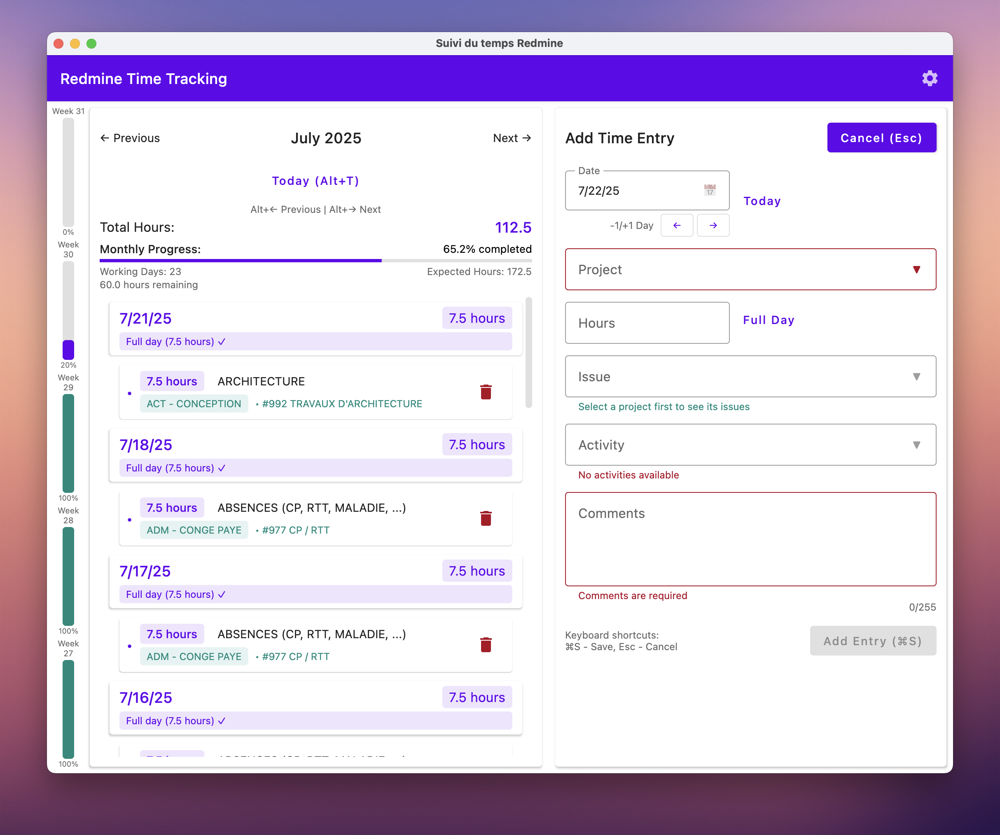

# RedmineTime

A desktop application for managing time entries in Redmine with a modern user interface built using Compose for Desktop.

[Version française (French version)](README_FR.md)



*The screenshot above shows the application in light theme. The application also supports a dark theme that can be
enabled in the settings.*

## Features

- **Monthly time entry overview** with intuitive navigation
- **Monthly progress tracking** with visual indicators showing completion percentage
- **Working days calculation** and expected hours tracking (working days × 7.5 hours)
- **Add and edit time entries** with comprehensive validation
- **Project and activity selection** with searchable dropdowns
- **Issue integration** - select issues associated with chosen projects
- **Easy navigation between months** with keyboard shortcuts
- **Quick time entry creation and editing** with intelligent defaults
- **SSL support** (including self-signed certificates with automatic trust and hostname verification disabled)
- **Native look and feel** that integrates with your operating system
- **Light and dark theme support** with system integration
- **Keyboard shortcuts** for improved productivity
- **Multilingual support** (French and English) with intelligent fallback
- **Robust error handling** with user-friendly error messages
- **Real-time validation** for all form fields

## Language Support

The application supports multiple languages with an intelligent fallback system:

- French (default language)
    - Primary language for all users
    - Falls back to English if a translation is missing

- English (fallback language)
    - Alternative language
    - Falls back to French if a translation is missing

### Language Configuration

The application uses French by default. You can change the language in the configuration panel:

1. Click the settings icon in the top bar
2. Select your preferred language (French or English) from the dropdown
3. Click Save

The application will reload with the selected language, and all dates will be formatted according to the selected
language.

Note: The application will automatically handle missing translations by falling back to the alternative language.

## Prerequisites

- Java Development Kit (JDK) 21 or later
- Redmine server instance (with API access enabled)

## Configuration

The application can be configured in two ways:

### GUI Configuration

Click the settings icon in the top bar to open the configuration dialog. You can set:

- Redmine URL
- API Key (the Redmine API key)
- Dark Theme

The configuration is automatically saved and stored securely using Java Preferences API in your system's preferences:

- Windows: Registry under `HKEY_CURRENT_USER\Software\JavaSoft\Prefs`
- macOS: `~/Library/Preferences/com.ps.redmine.plist` (Key: `/com/ps/redmine`)
- Linux: `~/.java/.userPrefs/com/ps/redmine/prefs.xml`

The configuration values are stored under the node `/com/ps/redmine` in these system-specific locations.

### Environment Variables

Alternatively, you can use environment variables (they take precedence over saved configuration):

- `REDMINE_URL`: The URL of your Redmine server
- `REDMINE_API_KEY`: Your Redmine API key
- `REDMINE_DARK_THEME`: Set to "true" to enable dark theme (default: "false")

Note: Language settings can only be changed through the configuration panel.

## Installation

### From Source

1. Clone the repository
2. Build the application:
   ```bash
   ./gradlew build
   ```
3. Run the application:
   ```bash
   ./gradlew run
   ```

### Native Installers

The application can be packaged as a native installer for different platforms:

- macOS (DMG)
- Windows (MSI and portable ZIP)
- Linux (DEB)

To create native installers:

```bash
./gradlew packageReleaseDmg    # For macOS
./gradlew packageReleaseMsi    # For Windows MSI installer
./gradlew createReleaseDistributable    # For Windows distributable files
# Then zip the files
# Windows: Compress-Archive -Path build/compose/binaries/main-release/app/* -DestinationPath RedmineTime-portable.zip
# Linux/macOS: zip -r RedmineTime-portable.zip build/compose/binaries/main-release/app/*
./gradlew packageReleaseDeb    # For Linux
```

### Continuous Integration

The project uses GitHub Actions for continuous integration and automated builds. On each push to the main branch or pull
request:

1. The application is built and tested on Windows and macOS
2. Native installers are created automatically:
    - Windows MSI installer
    - Windows portable application (ZIP)
    - macOS DMG

These artifacts are available for download from the GitHub Actions workflow run.

### Releases

When a new version is ready for release:

1. Create and push a tag with the version number prefixed with 'v' (e.g., `v1.0.0`, `v2.1.3`)
   ```bash
   git tag v1.0.0
   git push origin v1.0.0
   ```
2. GitHub Actions will automatically:
    - Build the application for all supported platforms
    - Create a new GitHub release with the tag name
    - Attach all built installers to the release

The released installers will be available on the GitHub Releases page.

## Usage

### Initial Setup

1. **Configure Redmine Connection**:
    - Option 1: Click the settings icon in the top bar to configure your Redmine connection
    - Option 2: Set the environment variables as described in the Configuration section
2. **Launch the application**

### Managing Time Entries

1. **Navigate between months** using the navigation buttons or keyboard shortcuts (Alt+← / Alt+→)
2. **View monthly progress**: The application displays:
    - Total hours logged for the month
    - Monthly progress indicator showing completion percentage
    - Working days calculation and expected hours (working days × 7.5)
    - Remaining hours needed to complete the month
3. **Add a new time entry**:
    - Click the "+" button or select "New entry"
    - Fill in the required information:
        - **Date**: Select the date for the time entry
        - **Hours**: Enter the number of hours worked
        - **Project**: Choose from available projects (searchable dropdown)
        - **Issue**: Select an issue from the chosen project
        - **Activity**: Select the type of activity performed
        - **Comments**: Add descriptive comments (required)
4. **Edit existing entries**: Click on any time entry in the list to edit it
5. **Save changes**: Use Ctrl/Cmd+S or click the Save button
6. **Cancel changes**: Press Escape or click Cancel

### Monthly Progress Tracking

The application automatically calculates and displays:

- **Working days** in the current month (excluding weekends)
- **Expected hours** (working days × 7.5 hours)
- **Completion percentage** with visual progress indicator
- **Color-coded status**: Green when the month is completed
- **Remaining hours** needed to reach the monthly target

Note: You can update your Redmine connection settings at any time by clicking the settings icon in the top bar. The
application will restart to apply the new configuration.

## Keyboard Shortcuts

- `Ctrl/Cmd + S`: Save current time entry
- `Escape`: Cancel current operation
- `Alt + Left Arrow`: Navigate to previous month
- `Alt + Right Arrow`: Navigate to next month
- `Alt + T`: Jump to current month

## Technical Details

Built with:

- **Kotlin** 2.2.0
- **Compose for Desktop** 1.8.2
- **Ktor Client** 3.2.0 (HTTP client for API communication)
- **Kotlin Coroutines** 1.10.2
- **Kotlinx DateTime** 0.6.1
- **Kotlinx Serialization** 1.9.0
- **Koin** 4.1.0 (Dependency Injection)
- **SLF4J** 2.0.16 + **Logback** 1.5.12 (Logging)
- **JUnit 5** 5.13.2 (Testing framework)

### Architecture

The application follows modern Kotlin development practices:

- **Compose UI**: Declarative UI framework for desktop applications
- **Coroutines**: Asynchronous programming for non-blocking operations
- **Dependency Injection**: Clean architecture with Koin
- **HTTP Client**: Ktor for robust API communication with SSL support
- **Serialization**: Kotlinx Serialization for JSON parsing
- **Date/Time**: Kotlinx DateTime for cross-platform date handling

## Credits

- Application icon created by Fabrice Perez
    - LinkedIn: [https://www.linkedin.com/in/perezfabrice/](https://www.linkedin.com/in/perezfabrice/)
