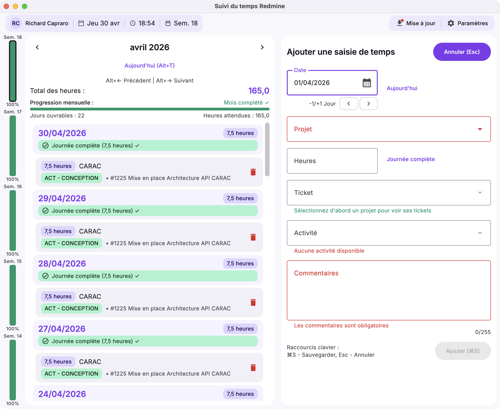

# RedmineTime | Gestion du temps Redmine

Une application de bureau pour gérer les saisies de temps dans Redmine avec une interface utilisateur moderne construite
avec Compose for Desktop.



*La capture d'écran ci-dessus montre l'application en thème clair. L'application prend également en charge un thème
sombre qui peut être activé dans les paramètres.*

## Fonctionnalités

- **Vue d'ensemble mensuelle des saisies** avec navigation intuitive
- **Barres de progression hebdomadaires et mensuelle** avec pourcentage de completion et infobulles par semaine ISO
- **Temps de travail configurable** — heures par jour (6 / 6,5 / 7 / 7,5 h) et jusqu'à 4 jours non travaillés en semaine
- **Ajout, modification et suppression de saisies** avec validation complète
- **Duplication de saisies** sur le même jour, sur le jour ouvré suivant, ou sur une plage de dates
- **Modification et suppression groupées** — sélectionnez plusieurs saisies pour modifier projet, activité, demande,
  heures ou commentaire en une seule opération
- **Sélecteurs de projet, ticket et activité** avec menus déroulants recherchables
- **Navigation facile entre les mois** avec boutons fléchés, raccourci « Aujourd'hui » et raccourcis clavier
- **Aide intégrée** (bouton Aide dans le bandeau supérieur) résumant les actions, icônes et raccourcis
- **Mises à jour intégrées** — un bouton « Téléchargement » apparaît dans le bandeau supérieur lorsqu'une nouvelle
  version stable est disponible
- **Impersonation** — les administrateurs peuvent saisir le temps pour le compte d'un autre utilisateur Redmine depuis
  le bandeau supérieur
- **Bandeau de statut en temps réel** affichant la date du jour, l'heure courante et le numéro de la semaine ISO
- **Support SSL** (y compris les certificats auto-signés avec confiance automatique et vérification du nom d'hôte
  désactivée)
- **Apparence native** qui s'intègre avec votre système d'exploitation
- **Thèmes clair et sombre**
- **Raccourcis clavier** pour une productivité améliorée
- **Support multilingue** (français et anglais) avec système de secours intelligent
- **Gestion d'erreurs robuste** avec messages d'erreur conviviaux
- **Validation en temps réel** pour tous les champs de formulaire

## Support linguistique

L'application prend en charge plusieurs langues avec un système de secours intelligent :

- Français (langue par défaut)
    - Langue principale pour tous les utilisateurs
    - Utilise l'anglais si une traduction est manquante

- Anglais (langue de secours)
    - Langue alternative
    - Utilise le français si une traduction est manquante

### Configuration de la langue

L'application utilise le français par défaut. Vous pouvez changer la langue dans le panneau de configuration :

1. Cliquez sur le bouton **Paramètres** (icône d'engrenage) dans le bandeau supérieur
2. Sélectionnez votre langue préférée (français ou anglais) dans le menu déroulant
3. Cliquez sur Enregistrer

L'application se rechargera avec la langue sélectionnée, et toutes les dates seront formatées selon la langue
sélectionnée.

Note : L'application gère automatiquement les traductions manquantes en utilisant la langue alternative.

## Prérequis

- Java Development Kit (JDK) 21 ou supérieur
- Instance serveur Redmine (avec accès API activé)

## Configuration

L'application peut être configurée de deux manières :

### Configuration graphique

Cliquez sur le bouton **Paramètres** (icône d'engrenage) dans le bandeau supérieur pour ouvrir la boîte de dialogue de
configuration. Vous pouvez définir :

- **URL Redmine**
- **Clé d'API** — la clé d'API Redmine (un bouton afficher/masquer et un lien « Comment obtenir votre clé d'API ? » sont
  disponibles)
- **Thème sombre** — bascule entre les thèmes clair et sombre Material 3
- **Langue** — français ou anglais
- **Heures par jour** — 6, 6,5, 7 ou 7,5 (sert de cible quotidienne, hebdomadaire et mensuelle)
- **Jours non travaillés** — jusqu'à 4 jours de la semaine (lundi–vendredi) qui ne comptent pas comme jours ouvrés

La configuration est automatiquement sauvegardée et stockée de manière sécurisée via l'API Java Preferences dans les
préférences de votre système :

- Windows: Registry under `HKEY_CURRENT_USER\Software\JavaSoft\Prefs`
- macOS: `~/Library/Preferences/com.ps.redmine.plist` (Key: `/com/ps/redmine`)
- Linux: `~/.java/.userPrefs/com/ps/redmine/prefs.xml`

Les valeurs de configuration sont stockées sous le nœud `/com/ps/redmine` dans ces emplacements spécifiques au système.

### Variables d'environnement

Alternativement, vous pouvez utiliser des variables d'environnement (elles ont la priorité sur la configuration
sauvegardée) :

- `REDMINE_URL`: L'URL de votre serveur Redmine
- `REDMINE_API_KEY`: Votre clé d'API Redmine
- `REDMINE_DARK_THEME`: Définir à "true" pour activer le thème sombre, sinon le thème clair est utilisé. Défaut : "
  false".

Note : Les paramètres de langue ne peuvent être modifiés que via le panneau de configuration.

## Installation

### Depuis les sources

1. Cloner le dépôt
2. Construire l'application :
   ```bash
   ./gradlew build
   ```
3. Lancer l'application :
   ```bash
   ./gradlew run
   ```

### Installateurs natifs

L'application peut être empaquetée comme un installateur natif pour différentes plateformes :

- macOS (DMG)
- Windows (MSI and portable ZIP)
- Linux (DEB)

Pour créer les installateurs natifs :

```bash
./gradlew packageReleaseDmg    # Pour macOS
./gradlew packageReleaseMsi    # Pour Windows installateur MSI
./gradlew createReleaseDistributable    # Pour Windows fichiers distribuables
# Puis compresser les fichiers
# Windows: Compress-Archive -Path build/compose/binaries/main-release/app/* -DestinationPath RedmineTime-portable.zip
# Linux/macOS: zip -r RedmineTime-portable.zip build/compose/binaries/main-release/app/*
./gradlew packageReleaseDeb    # Pour Linux
```

### Intégration Continue

Le projet utilise GitHub Actions pour l'intégration continue et les builds automatisés. À chaque push sur la branche
principale ou pull request :

1. L'application est construite et testée sur Windows et macOS
2. Des installateurs natifs sont créés automatiquement :
    - Installateur Windows MSI
    - Application portable Windows (ZIP)
    - macOS DMG

Ces artefacts sont disponibles au téléchargement depuis l'exécution du workflow GitHub Actions.

### Versions

Lorsqu'une nouvelle version est prête pour la publication :

1. Créez et poussez un tag avec le numéro de version préfixé par 'v' (par exemple, `v1.0.0`, `v2.1.3`)
   ```bash
   git tag v1.0.0
   git push origin v1.0.0
   ```
2. GitHub Actions va automatiquement :
    - Construire l'application pour toutes les plateformes supportées
    - Créer une nouvelle version GitHub avec le nom du tag
    - Joindre tous les installateurs construits à la version

Les installateurs publiés seront disponibles sur la page des versions GitHub.

## Utilisation

### Configuration initiale

1. **Configurer la connexion Redmine** :
    - Option 1 : Cliquez sur le bouton **Paramètres** (icône d'engrenage) dans le bandeau supérieur pour configurer
      votre connexion Redmine
    - Option 2 : Définir les variables d'environnement comme décrit dans la section Configuration
2. **Lancer l'application**

### Bandeau supérieur

Le bandeau supérieur regroupe les informations de statut et les actions globales :

- **Pastille utilisateur** — affiche votre compte ; les administrateurs peuvent cliquer dessus pour saisir le temps pour
  un autre utilisateur Redmine (un badge coloré rappelle alors pour qui vous saisissez). Choisissez « Moi-même » pour
  revenir sur votre compte. L'impersonation n'est jamais persistée.
- **Pastilles d'information** — date du jour, heure courante et numéro de la semaine ISO.
- **Mise à jour** (icône de téléchargement, avec un point rouge) — n'apparaît que lorsqu'une nouvelle version stable est
  disponible ; ouvre la boîte de dialogue de mise à jour avec les notes de version et un téléchargement direct de
  l'installateur correspondant à votre OS.
- **Paramètres** (icône d'engrenage) — ouvre la boîte de dialogue de configuration.
- **Aide** (icône point d'interrogation) — ouvre un guide intégré listant chaque action, icône et raccourci.

### Gestion des saisies de temps

1. **Naviguer entre les mois** avec les flèches au-dessus de la liste, le raccourci « Aujourd'hui (Alt+T) » ou les
   raccourcis clavier (Alt+← / Alt+→).
2. **Voir la progression mensuelle et hebdomadaire** : une colonne de barres de progression hebdomadaires se trouve à
   l'extrême gauche, à côté du total mensuel. L'application affiche :
    - Total des heures saisies pour le mois
    - Progression mensuelle avec pourcentage de completion et célébration lorsque le mois est terminé
    - Jours ouvrables du mois courant (hors week-ends et hors jours non travaillés configurés)
    - Heures attendues (jours ouvrables × heures par jour configurées)
    - Heures restantes pour compléter le mois
    - Barres de progression par semaine, avec infobulle indiquant la plage de dates et heures / objectif. Cliquez sur
      une barre hebdomadaire pour vous positionner sur le premier jour ouvré de cette semaine.
3. **Ajouter une nouvelle saisie de temps** : le panneau de droite est le formulaire de création/édition. Désélectionnez
   la saisie courante (ou changez de jour) pour afficher le formulaire de création, puis remplissez :
    - **Date** — choisir une date avec l'icône calendrier, ou utiliser les boutons `-1 / +1 jour` (jours ouvrés)
    - **Heures** — nombre d'heures travaillées
    - **Projet** — menu déroulant recherchable
    - **Ticket** — menu déroulant recherchable filtré par le projet sélectionné
    - **Activité** — menu déroulant recherchable
    - **Commentaires** — obligatoires, 255 caractères max
4. **Modifier une saisie existante** : cliquez sur n'importe quelle saisie de la liste pour la charger dans le
   formulaire de droite.
5. **Dupliquer une saisie** : chaque ligne possède une icône de copie qui ouvre un menu — dupliquer pour le même jour,
   pour le jour ouvré suivant, ou sur une plage de dates (seuls les jours ouvrés de la plage sont dupliqués).
6. **Supprimer une saisie** : cliquez sur l'icône poubelle rouge de la ligne ; une boîte de confirmation s'affiche.
7. **Actions groupées** : cochez la case de plusieurs saisies pour faire apparaître la barre d'actions groupées
   au-dessus de la liste :
    - **Modifier** — ouvre la boîte de dialogue de modification groupée et permet de choisir quels champs (projet,
      activité, ticket, heures, commentaire) appliquer à toutes les saisies sélectionnées.
    - **Supprimer** — supprime toutes les saisies sélectionnées après confirmation.
    - **Fermer** (X) — vide la sélection courante.
8. **Sauvegarder les modifications** : utilisez Ctrl/Cmd+S ou cliquez sur le bouton Enregistrer.
9. **Annuler les modifications** : appuyez sur Échap ou cliquez sur Annuler.

### Suivi de progression mensuelle

L'application calcule et affiche automatiquement :

- **Jours ouvrables** dans le mois courant (lundi–vendredi moins les jours non travaillés configurés)
- **Heures attendues** (jours ouvrables × heures par jour configurées)
- **Pourcentage de completion** avec indicateur de progression visuel
- **Détail par semaine** pour repérer en un clin d'œil la semaine où il manque des heures
- **Statut codé par couleur** : vert lorsque le jour ou le mois est complet, ambre/rouge lorsqu'il manque ou qu'il y a
  trop d'heures
- **Heures restantes** pour atteindre l'objectif mensuel

Note : Vous pouvez mettre à jour vos paramètres de connexion Redmine à tout moment depuis le bouton **Paramètres** dans
le bandeau supérieur. L'application prend en compte les nouveaux identifiants et recharge les données sans
redémarrer.

## Raccourcis clavier

- `Ctrl/Cmd + S`: Sauvegarder la saisie de temps
- `Escape`: Annuler l'opération en cours
- `Alt + Left Arrow`: Naviguer vers le mois précédent
- `Alt + Right Arrow`: Naviguer vers le mois suivant
- `Alt + T`: Aller au mois courant

## Détails techniques

Construit avec :

- **Kotlin** 2.2.0
- **Compose for Desktop** 1.8.2
- **Ktor Client** 3.2.0 (client HTTP pour la communication API)
- **Kotlin Coroutines** 1.10.2
- **Kotlinx DateTime** 0.6.1
- **Kotlinx Serialization** 1.9.0
- **Koin** 4.1.0 (Injection de dépendances)
- **SLF4J** 2.0.16 + **Logback** 1.5.12 (Journalisation)
- **JUnit 5** 5.13.2 (Framework de test)

### Architecture

L'application suit les pratiques modernes de développement Kotlin :

- **Interface utilisateur Compose** : Framework d'interface utilisateur déclarative pour applications de bureau
- **Coroutines** : Programmation asynchrone pour des opérations non-bloquantes
- **Injection de dépendances** : Architecture propre avec Koin
- **Client HTTP** : Ktor pour une communication API robuste avec support SSL
- **Sérialisation** : Kotlinx Serialization pour l'analyse JSON
- **Date/Heure** : Kotlinx DateTime pour la gestion des dates multi-plateforme

## Crédits

- Icône de l'application créée par Fabrice Perez
    - LinkedIn: [https://www.linkedin.com/in/perezfabrice/](https://www.linkedin.com/in/perezfabrice/)
