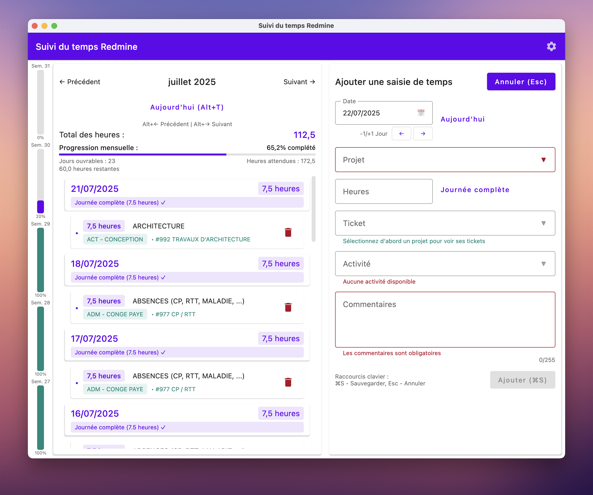

# RedmineTime | Gestion du temps Redmine

Une application de bureau pour gérer les saisies de temps dans Redmine avec une interface utilisateur moderne construite
avec Compose for Desktop.



*La capture d'écran ci-dessus montre l'application en thème clair. L'application prend également en charge un thème
sombre qui peut être activé dans les paramètres.*

## Fonctionnalités

- Vue d'ensemble mensuelle des temps
- Ajout et modification des temps
- Sélection de projet et d'activité
- Navigation facile entre les mois
- Création et modification rapide des temps
- Support SSL (y compris les certificats auto-signés avec confiance automatique et vérification du nom d'hôte
  désactivée)
- Apparence native
- Support des thèmes clair et sombre
- Raccourcis clavier pour une meilleure productivité
- Support de la langue française

## Support linguistique

L'application prend en charge plusieurs langues avec un système de secours intelligent :

- Français (langue par défaut)
    - Langue principale pour tous les utilisateurs
    - Utilise l'anglais si une traduction est manquante

- Anglais (langue de secours)
    - Langue alternative
    - Utilise le français si une traduction est manquante

### Configuration de la langue

L'application utilise le français par défaut. Vous pouvez changer la langue dans le panneau de configuration :

1. Cliquez sur l'icône des paramètres dans la barre supérieure
2. Sélectionnez votre langue préférée (français ou anglais) dans le menu déroulant
3. Cliquez sur Enregistrer

L'application se rechargera avec la langue sélectionnée, et toutes les dates seront formatées selon la langue
sélectionnée.

Note : L'application gère automatiquement les traductions manquantes en utilisant la langue alternative.

## Prérequis

- Java Development Kit (JDK) 17 ou supérieur
- Instance serveur Redmine (avec accès API)

## Configuration

L'application peut être configurée de deux manières :

### Configuration graphique

Cliquez sur l'icône des paramètres dans la barre supérieure pour ouvrir la boîte de dialogue de configuration. Vous
pouvez définir :

- URL Redmine
- Nom d'utilisateur
- Mot de passe
- Thème sombre

La configuration est automatiquement sauvegardée et stockée de manière sécurisée via l'API Java Preferences dans les
préférences de votre système :

- Windows: Registry under `HKEY_CURRENT_USER\Software\JavaSoft\Prefs`
- macOS: `~/Library/Preferences/com.ps.redmine.plist` (Key: `/com/ps/redmine`)
- Linux: `~/.java/.userPrefs/com/ps/redmine/prefs.xml`

Les valeurs de configuration sont stockées sous le nœud `/com/ps/redmine` dans ces emplacements spécifiques au système.

### Variables d'environnement

Alternativement, vous pouvez utiliser des variables d'environnement (elles ont la priorité sur la configuration
sauvegardée) :

- `REDMINE_URL`: L'URL de votre serveur Redmine (default: "https://redmine-restreint.packsolutions.local")
- `REDMINE_USERNAME`: Votre nom d'utilisateur Redmine
- `REDMINE_PASSWORD`: Votre mot de passe Redmine
- `REDMINE_DARK_THEME`: Définir à "true" pour activer le thème sombre (default: "false")

Note : Les paramètres de langue ne peuvent être modifiés que via le panneau de configuration.

## Installation

### Depuis les sources

1. Cloner le dépôt
2. Construire l'application :
   ```bash
   ./gradlew build
   ```
3. Lancer l'application :
   ```bash
   ./gradlew run
   ```

### Installateurs natifs

L'application peut être empaquetée comme un installateur natif pour différentes plateformes :

- macOS (DMG)
- Windows (MSI and portable ZIP)
- Linux (DEB)

Pour créer les installateurs natifs :

```bash
./gradlew packageReleaseDmg    # Pour macOS
./gradlew packageReleaseMsi    # Pour Windows installateur MSI
./gradlew createReleaseDistributable    # Pour Windows fichiers distribuables
# Puis compresser les fichiers
# Windows: Compress-Archive -Path build/compose/binaries/main-release/app/* -DestinationPath RedmineTime-portable.zip
# Linux/macOS: zip -r RedmineTime-portable.zip build/compose/binaries/main-release/app/*
./gradlew packageReleaseDeb    # Pour Linux
```

### Intégration Continue

Le projet utilise GitHub Actions pour l'intégration continue et les builds automatisés. À chaque push sur la branche
principale ou pull request :

1. L'application est construite et testée sur Windows et macOS
2. Des installateurs natifs sont créés automatiquement :
    - Installateur Windows MSI
    - Application portable Windows (ZIP)
    - macOS DMG

Ces artefacts sont disponibles au téléchargement depuis l'exécution du workflow GitHub Actions.

## Utilisation

1. Configuration initiale
    - Option 1: Cliquer sur l'icône des paramètres dans la barre supérieure pour configurer votre connexion Redmine
    - Option 2: Définir les variables d'environnement comme décrit dans la section Configuration
2. Lancer l'application
3. Naviguer vers le mois souhaité en utilisant les boutons de navigation ou les raccourcis clavier
4. Cliquer sur le bouton "+" pour ajouter une nouvelle saisie de temps
5. Remplir les informations requises :
    - Date
    - Heures
    - Projet
    - Activité
    - Commentaires (optionnel)
6. Sauvegarder la saisie de temps

Note : Vous pouvez mettre à jour vos paramètres de connexion Redmine à tout moment en cliquant sur l'icône des
paramètres dans la barre supérieure. L'application redémarrera pour appliquer la nouvelle configuration.

## Raccourcis clavier

- `Ctrl/Cmd + S`: Sauvegarder la saisie de temps
- `Escape`: Annuler l'opération en cours
- `Alt + Left Arrow`: Naviguer vers le mois précédent
- `Alt + Right Arrow`: Naviguer vers le mois suivant
- `Alt + T`: Aller au mois courant

## Détails techniques

Construit avec :

- Kotlin 2.1.10
- Compose for Desktop 1.7.3
- Redmine Java API 3.1.3
- Coroutines Kotlin 1.10.1
- DateTime Kotlinx 0.6.2
- Koin 4.0.2 (Dependency Injection)
- Apache HttpClient 4.5.14

## Crédits

- Icône de l'application créée par Fabrice Perez
    - LinkedIn: [https://www.linkedin.com/in/perezfabrice/](https://www.linkedin.com/in/perezfabrice/)
